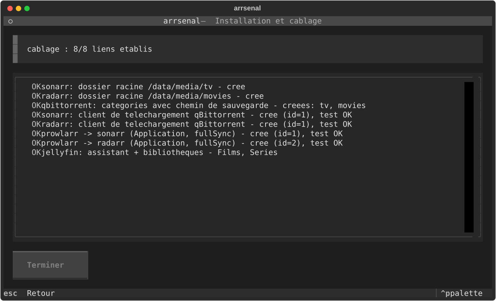
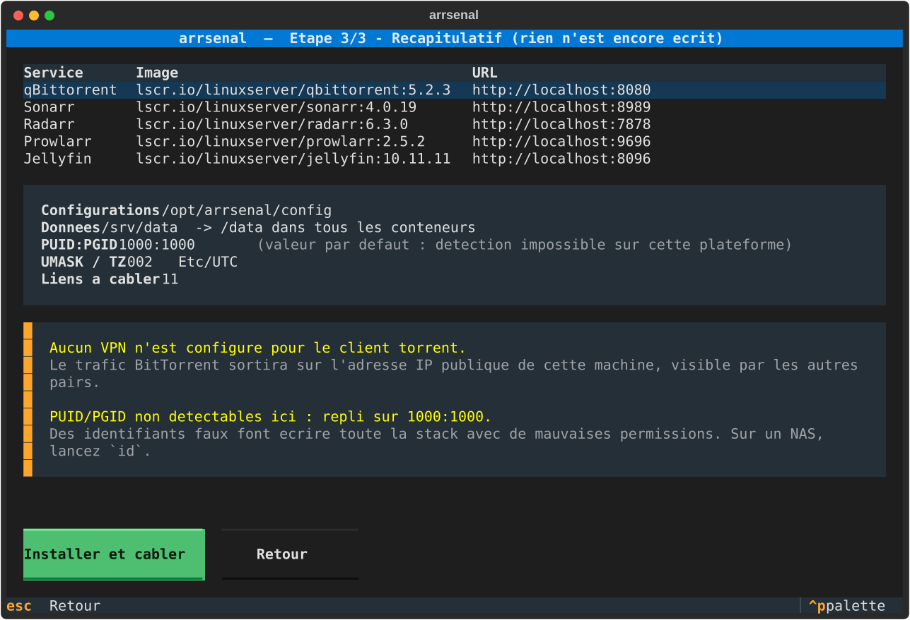
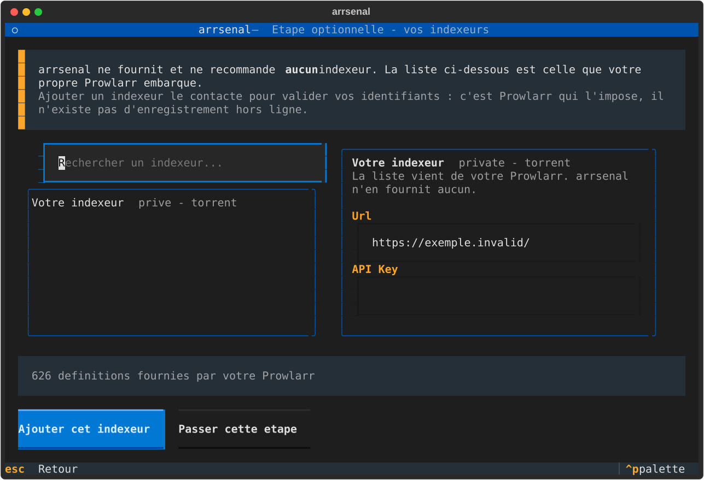
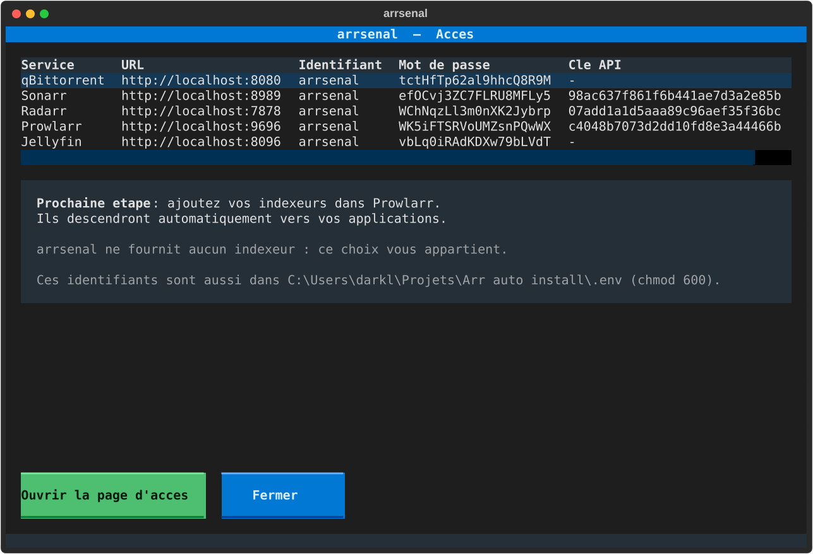

# arrsenal

**Déploie *et câble* une stack média complète. Une commande, zéro clic dans huit interfaces web.**

```bash
arrsenal
```

<p align="center">
  
  
</p>

Vous cochez ce que vous voulez. À la fin, Prowlarr pousse déjà ses indexeurs vers Sonarr,
Radarr et Lidarr, les trois savent parler à votre client de téléchargement, leurs dossiers
racine existent, et Jellyfin a ses bibliothèques et se rafraîchit tout seul après chaque
import.

Pas d'assistant ? La même chose en une ligne, pour un script ou une CI :

```bash
arrsenal install --yes --data-root /srv/data --config-root /opt/arrsenal/config
```

---

## Le problème

Poser six conteneurs avec un `docker-compose.yml`, tout le monde sait faire.
Des dizaines de dépôts le font très bien.

Ce qui prend trois heures, c'est **l'après** : ouvrir chaque interface, copier une clé
API, la coller dans une autre, recommencer, se tromper de port, découvrir trois jours
plus tard que les imports recopient 40 Go au lieu de faire un lien.

`arrsenal` automatise cette partie-là.

| | Déploiement | Câblage inter-apps | Profils qualité |
|---|---|---|---|
| DockSTARTer | oui | non | non |
| Saltbox | oui | partiel | non |
| Recyclarr / Configarr | non | non | oui |
| **arrsenal** | **oui** | **oui** | phase 4 |

---

## Ce qui est câblé automatiquement

| Source | Cible | Ce qui est posé |
|---|---|---|
| Prowlarr | Sonarr, Radarr, Lidarr | enregistrement en *Application*, `fullSync` des indexeurs |
| Prowlarr | client de téléchargement | rattachement + catégorie |
| Sonarr, Radarr, Lidarr | client de téléchargement | rattachement + routage par catégorie ou répertoire |
| Sonarr, Radarr, Lidarr | système de fichiers | dossier racine sous `/data/media` |
| qBittorrent | lui-même | catégories créées avec leur chemin de sauvegarde |
| Sonarr, Radarr | Jellyfin | notification de rafraîchissement après import |
| Jellyfin | système de fichiers | assistant de démarrage + bibliothèques Films, Séries, Musique |

Les deux clients de téléchargement peuvent coexister : chaque *arr est rattaché aux
deux, et le routage s'adapte tout seul — qBittorrent a des catégories natives,
Transmission n'en a pas.

Chaque lien est **relu depuis l'API cible** après création. Le rapport final ne dit pas
« j'ai envoyé un POST », il dit « le lien existe ».

---

## Le piège que tout le monde rate : un seul montage `/data`

C'est l'erreur numéro un des stacks média. Monter `/downloads` et `/media` séparément
donne deux systèmes de fichiers *vus depuis le conteneur*. Les hardlinks deviennent
impossibles, et chaque import **recopie** le fichier au lieu de le lier.

`arrsenal` impose un montage unique dans tous les conteneurs :

```
${DATA_ROOT}/                    ->  /data   (dans TOUS les conteneurs)
├── torrents/
│   ├── movies/
│   ├── tv/
│   ├── music/
│   └── .incomplete/
└── media/
    ├── movies/                  <- dossier racine Radarr + bibliothèque Jellyfin
    ├── tv/                      <- dossier racine Sonarr + bibliothèque Jellyfin
    └── music/                   <- dossier racine Lidarr + bibliothèque Jellyfin
```

Le préflight ne se contente pas de l'espérer : il **crée un vrai hardlink** entre
`torrents/` et `media/` et vous dit si ça a marché.

---

## Installation

Prérequis : Docker Engine (ou Docker Desktop) avec le plugin `docker compose`.

```bash
pipx install arrsenal
```

Aperçu sans rien écrire :

```bash
arrsenal install --dry-run
```

Sélection à la carte :

```bash
arrsenal install --services prowlarr,sonarr,radarr,qbittorrent,jellyfin
```

Autres commandes :

```bash
arrsenal             # assistant interactif
arrsenal list        # catalogue des services
arrsenal indexers    # chercher et ajouter vos indexeurs
arrsenal wire        # rejoue le câblage sur une stack déjà démarrée
arrsenal doctor      # diagnostique une installation existante
arrsenal generate    # régénère docker-compose.yml depuis stack.yml
arrsenal uninstall   # arrête la stack, ne touche jamais à vos médias
```

Toutes les captures de ce README sont **générées automatiquement** par
`python scripts/screenshots.py`, sans terminal ni Docker. Elles sont versionnées : une
régression visuelle apparaît dans le diff d'une pull request.

<details>
<summary>Les autres écrans de l'assistant</summary>

| | |
|---|---|
|  |  |
|  |  |
|  | |

</details>

---

## La page d'accès

À la fin de l'installation, `arrsenal` génère une page HTML locale et l'ouvre dans votre
navigateur. Plus besoin de retrouver quel service écoute sur quel port : une carte par
service, les dossiers de téléchargement et de médiathèque, les identifiants.

Trois détails qui comptent :

- **Les mots de passe et clés API sont masqués** jusqu'à un clic. La page reste un
  fichier local en `chmod 600`, exclu du dépôt — mais on la montre parfois à quelqu'un,
  et elle ne doit pas afficher votre clé Sonarr d'entrée.
- **Les liens n'utilisent pas `localhost`.** Installée sur un NAS, une URL en localhost
  pointerait vers la machine qui consulte. `arrsenal` détecte l'adresse de la machine
  sur le réseau local et génère les liens avec.
- **Les raccourcis vers les dossiers sont donnés en chemin copiable *et* en lien.**
  Un lien `file://` ne fonctionne que si le navigateur tourne sur la machine
  d'installation ; c'est écrit sur la page plutôt que découvert par un lien mort.

`--no-open` génère la page sans ouvrir le navigateur.

---

## Comment ça marche

**Les clés API sont pré-semées, pas devinées.** Plutôt que de démarrer les conteneurs
puis de courir après une clé générée aléatoirement, `arrsenal` écrit lui-même le
`config.xml` avant le premier démarrage. Le câblage devient déterministe et rejouable.

**Les payloads viennent des schémas.** Aucun JSON de client de téléchargement n'est codé
en dur. `arrsenal` demande son gabarit à l'application (`/api/v3/downloadclient/schema`),
remplit les champs par nom, et renvoie l'objet. Quand une nouvelle version renomme un
champ, le gabarit suit. Les champs qu'une version n'expose pas sont **signalés**, jamais
perdus en silence.

**Tout est idempotent.** Relancer `install` sur une stack existante ne crée pas de
doublon et n'écrase aucun réglage manuel. Un `config.xml` déjà présent fait autorité :
`arrsenal` adopte sa clé plutôt que d'imposer la sienne.

**`stack.yml` est la source de vérité.** `docker-compose.yml` et `.env` en sont des
artefacts générés, versionnables et diffables. Ne les éditez pas à la main.

---

## Sécurité

Les interfaces web sont protégées par un **login** (`Forms` + `Enabled`), avec un mot de
passe généré par installation. L'API reste joignable par clé, ce qui permet le câblage
automatique sans laisser Sonarr et Radarr ouverts à tout le réseau local.

Les identifiants sont écrits dans `.env` en `chmod 600`, déjà couvert par le
`.gitignore` généré, et masqués dans les journaux.

**Sans VPN**, le trafic BitTorrent sort sur votre IP publique. `arrsenal` vous
l'affiche au récapitulatif. Le support Gluetun arrive en phase 4 ; la bascule est déjà
prévue dans le générateur de compose.

---

## Vos indexeurs

Une fois la stack en place, l'assistant propose une **étape optionnelle** pour saisir
les indexeurs que vous utilisez déjà. Elle se passe d'un bouton.

La liste proposée n'est pas la nôtre : ce sont les **626 définitions que votre propre
Prowlarr embarque**. `arrsenal` n'est qu'un formulaire par-dessus, et n'en présélectionne
aucune. Il devine quels champs sont des identifiants (clé API, passkey, cookie, mot de
passe) et n'affiche que ceux-là, plutôt que de vous noyer sous la douzaine d'options de
réglage que chaque définition traîne.

En ligne de commande, la même chose reste scriptable :

```bash
arrsenal indexers search <terme>          # chercher dans les définitions de VOTRE Prowlarr
arrsenal indexers add "<nom>" -f apiKey=… # ajouter avec VOS identifiants
arrsenal indexers list                    # ce qui est déjà configuré
```

Un point à connaître : **ajouter un indexeur le contacte** pour valider vos identifiants.
C'est Prowlarr qui l'impose — `forceSave` n'y change rien, il n'existe pas
d'enregistrement hors ligne. La contrepartie est agréable : si l'ajout réussit, vos
identifiants sont bons.

---

## Ce que ce projet ne fait pas

`arrsenal` ne fournit, n'héberge et ne recommande **aucun indexeur, aucun tracker, aucun
contenu**, et n'en préconfigure aucun. Aucune liste n'est livrée avec le code : celle de
l'assistant vient de Prowlarr. C'est un outil d'automatisation de médiathèque personnelle.
Ce que vous y branchez, et sa légalité, vous regardent.
Voir [DISCLAIMER.md](DISCLAIMER.md).

---

## Périmètre actuel

Prowlarr · Sonarr · Radarr · **Lidarr** · Transmission · **qBittorrent** · Jellyfin
· Flood *(UI optionnelle)*

Un service n'entre au catalogue que lorsqu'il est **câblé et vérifié**. Bazarr a déjà
été étudié mais reste absent : sa configuration passe par un fichier YAML et non par
une API, et rien n'a encore été vérifié.

Versions testées : voir [docs/COMPATIBILITY.md](docs/COMPATIBILITY.md).
Suite prévue : Bazarr, SABnzbd, Plex, Jellyseerr, Audiobookshelf, Shelfmark, Shelfarr
— voir [PROMPT.md](PROMPT.md) pour la feuille de route.

**Readarr n'est pas au programme** : le projet est archivé depuis le 27 juin 2025.

---

## Contribuer

Une règle avant tout : **ne devinez aucun endpoint, aucun tag d'image, aucun port.**
Vérifiez contre la doc officielle ou contre une instance réelle. Quand ce n'est pas
vérifiable, marquez `TODO(verify)` plutôt que d'écrire du code plausible mais faux.
La fiabilité du câblage est la seule raison d'être de ce projet.

## Remerciements

[TRaSH Guides](https://trash-guides.info/), [Servarr](https://wiki.servarr.com/) et
[LinuxServer.io](https://www.linuxserver.io/), sans qui rien de tout ceci n'existerait.

## Licence

MIT
