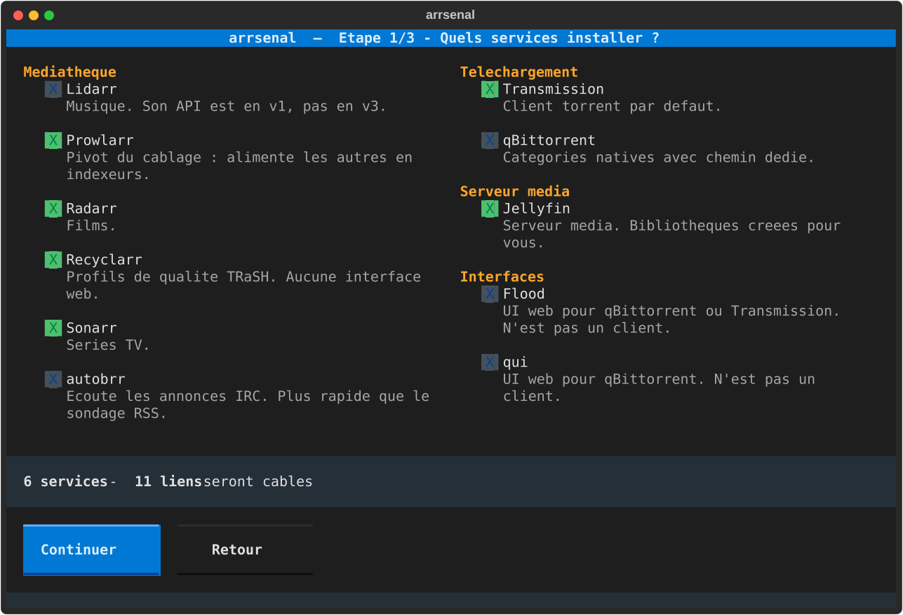
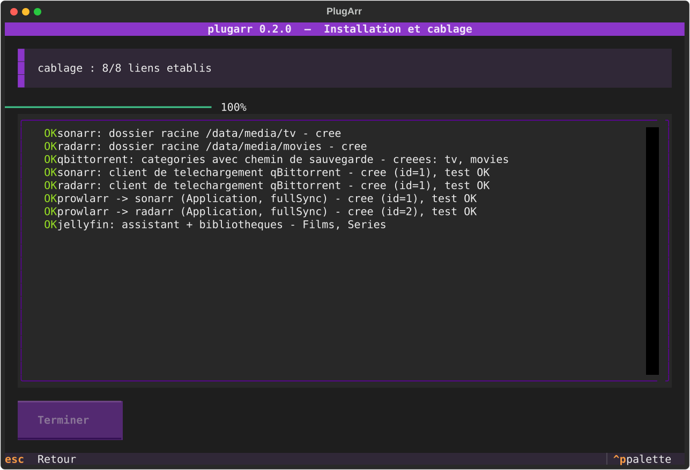
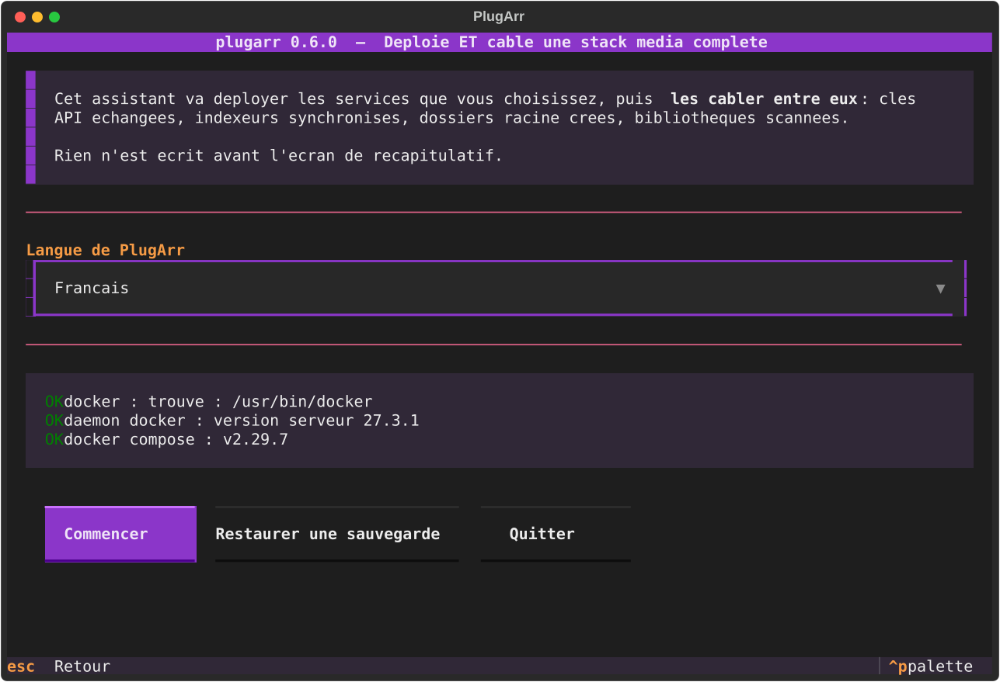
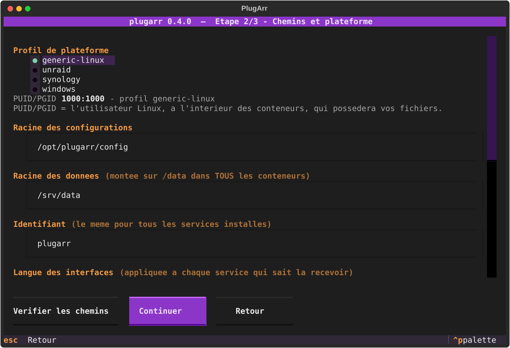
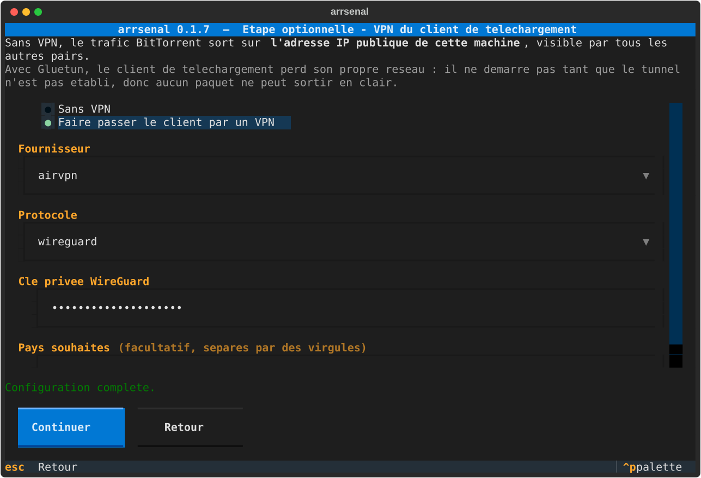
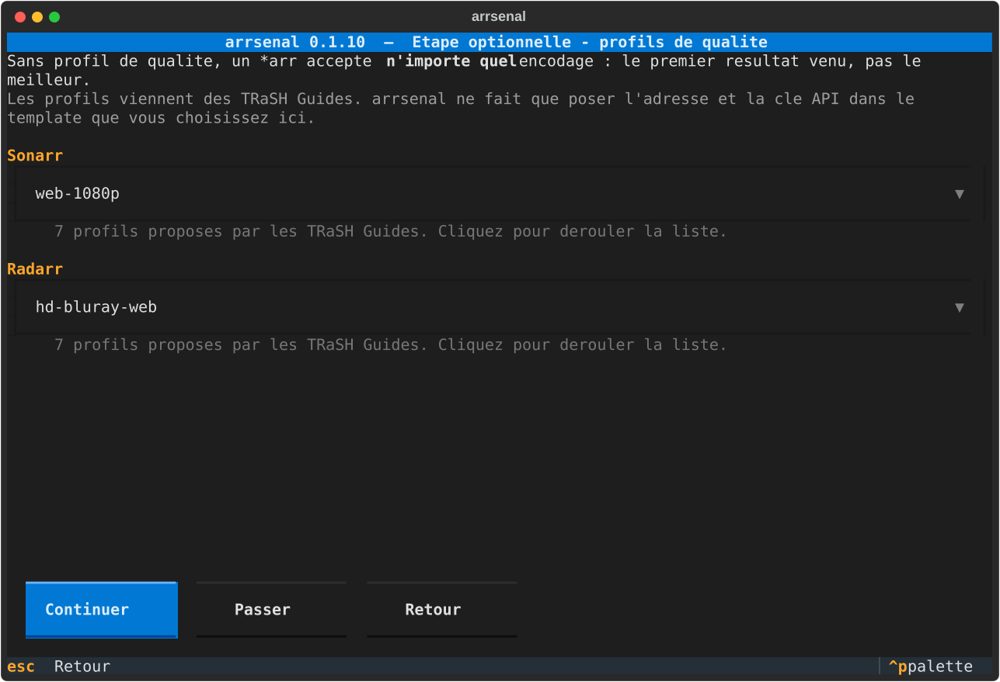
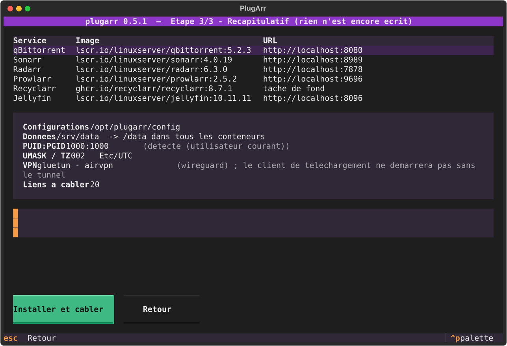
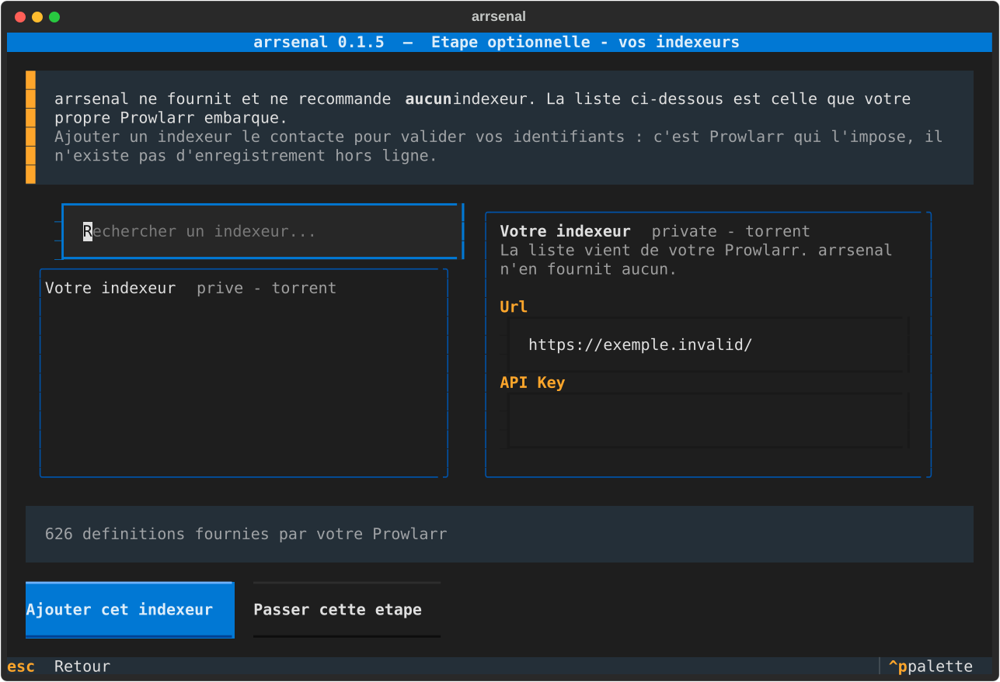
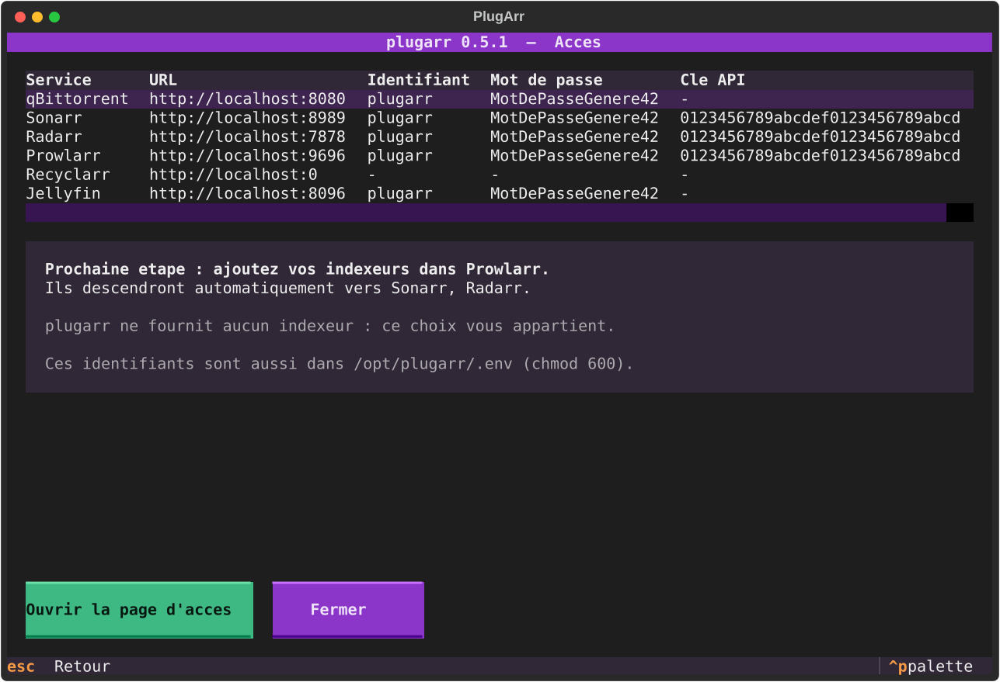

# arrsenal

**Déploie *et câble* une stack média complète. Une commande, zéro clic dans huit interfaces web.**

```bash
arrsenal
```

<p align="center">
  
  
</p>

Vous cochez ce que vous voulez. À la fin, Prowlarr pousse déjà ses indexeurs vers Sonarr,
Radarr et Lidarr, les trois savent parler à votre client de téléchargement, leurs dossiers
racine existent, et Jellyfin a ses bibliothèques et se rafraîchit tout seul après chaque
import.

Pas d'assistant ? La même chose en une ligne, pour un script ou une CI :

```bash
arrsenal install --yes --data-root /srv/data --config-root /opt/arrsenal/config
```

---

## Le problème

Poser six conteneurs avec un `docker-compose.yml`, tout le monde sait faire.
Des dizaines de dépôts le font très bien.

Ce qui prend trois heures, c'est **l'après** : ouvrir chaque interface, copier une clé
API, la coller dans une autre, recommencer, se tromper de port, découvrir trois jours
plus tard que les imports recopient 40 Go au lieu de faire un lien.

`arrsenal` automatise cette partie-là.

| | Déploiement | Câblage inter-apps | Profils qualité |
|---|---|---|---|
| DockSTARTer | oui | non | non |
| Saltbox | oui | partiel | non |
| Recyclarr / Configarr | non | non | oui |
| **arrsenal** | **oui** | **oui** | **oui** (via Recyclarr) |

---

## Ce qui est câblé automatiquement

| Source | Cible | Ce qui est posé |
|---|---|---|
| Prowlarr | Sonarr, Radarr, Lidarr | enregistrement en *Application*, `fullSync` des indexeurs |
| autobrr | Sonarr, Radarr, Lidarr, client de téléchargement | déclarés dans autobrr, connexions testées |
| Prowlarr | client de téléchargement | rattachement + catégorie |
| Sonarr, Radarr, Lidarr | client de téléchargement | rattachement + routage par catégorie ou répertoire |
| Sonarr, Radarr, Lidarr | système de fichiers | dossier racine sous `/data/media` |
| qBittorrent | lui-même | catégories créées avec leur chemin de sauvegarde |
| Sonarr, Radarr | Jellyfin | notification de rafraîchissement après import |
| Jellyfin | système de fichiers | assistant de démarrage + bibliothèques Films, Séries, Musique |
| Sonarr, Radarr, Lidarr, Prowlarr | interface web | compte créé, **connexion réellement testée** |
| Recyclarr | Sonarr, Radarr | profils de qualité et custom formats des TRaSH Guides, adresse et clé posées dans le template officiel, **première synchronisation lancée** |
| qui | qBittorrent | compte créé, instance déclarée, connexion confirmée par qui |
| Flood | qBittorrent | URL et identifiants passés au démarrage |

Les deux clients de téléchargement peuvent coexister : chaque *arr est rattaché aux
deux, et le routage s'adapte tout seul — qBittorrent a des catégories natives,
Transmission n'en a pas.

Chaque lien est **relu depuis l'API cible** après création. Le rapport final ne dit pas
« j'ai envoyé un POST », il dit « le lien existe ».

---

## Le piège que tout le monde rate : un seul montage `/data`

C'est l'erreur numéro un des stacks média. Monter `/downloads` et `/media` séparément
donne deux systèmes de fichiers *vus depuis le conteneur*. Les hardlinks deviennent
impossibles, et chaque import **recopie** le fichier au lieu de le lier.

`arrsenal` impose un montage unique dans tous les conteneurs :

```
${DATA_ROOT}/                    ->  /data   (dans TOUS les conteneurs)
├── torrents/
│   ├── movies/
│   ├── tv/
│   ├── music/
│   └── .incomplete/
└── media/
    ├── movies/                  <- dossier racine Radarr + bibliothèque Jellyfin
    ├── tv/                      <- dossier racine Sonarr + bibliothèque Jellyfin
    └── music/                   <- dossier racine Lidarr + bibliothèque Jellyfin
```

Le préflight ne se contente pas de l'espérer : il **crée un vrai hardlink** entre
`torrents/` et `media/` et vous dit si ça a marché.

---

## Installation

### Windows : un seul fichier, sans Python

Téléchargez `arrsenal.exe` depuis la
[dernière version](https://github.com/yannickuhrig1/arrsenal/releases), ouvrez un
terminal dans le dossier de téléchargement, et lancez :

```bash
.\arrsenal.exe
```

Seul Docker Desktop est nécessaire. L'exécutable embarque son propre interpréteur : il
fonctionne sans Python installé, ce qui a été vérifié en le lançant avec un `PATH` vidé.
20 Mo, environ une seconde et demie au démarrage.

Windows SmartScreen peut afficher un avertissement au premier lancement : le binaire
n'est pas signé — une signature de code coûte plusieurs centaines d'euros par an.
« Informations complémentaires », puis « Exécuter quand même ».

### Les autres plateformes

Prérequis : Docker Engine (ou Docker Desktop) avec le plugin `docker compose`, et
Python 3.12 ou plus récent.

Quatre profils de plateforme : `windows`, `generic-linux`, `unraid`, `synology`.
Celui de la machine est présélectionné, avec les chemins qui vont avec.

```bash
pipx install git+https://github.com/yannickuhrig1/arrsenal
```

Sans `pipx`, un environnement virtuel fait la même chose :

```bash
python -m venv ~/.venvs/arrsenal && ~/.venvs/arrsenal/bin/pip install git+https://github.com/yannickuhrig1/arrsenal
```

Le paquet n'est pas encore sur PyPI : `pipx install arrsenal` ne fonctionnera qu'après
la première publication.

Aperçu sans rien écrire :

```bash
arrsenal install --dry-run
```

Sélection à la carte :

```bash
arrsenal install --services prowlarr,sonarr,radarr,qbittorrent,jellyfin
```

Autres commandes :

```bash
arrsenal             # assistant interactif
arrsenal list        # catalogue des services
arrsenal scan        # detecte une stack existante
arrsenal adopt       # cable une stack existante sans la recreer
arrsenal serve       # page d'administration : etat, demarrer / arreter
arrsenal indexers    # chercher et ajouter vos indexeurs
arrsenal wire        # rejoue le câblage sur une stack déjà démarrée
arrsenal doctor      # diagnostique une installation existante
arrsenal generate    # régénère docker-compose.yml depuis stack.yml
arrsenal uninstall   # arrête la stack, ne touche jamais à vos médias
```

### Après l'installation : la page d'administration

La page d'accès est un **fichier figé** : elle liste les adresses et les identifiants,
rien de plus. L'état des services, les boutons démarrer / arrêter / redémarrer et les
mises à jour disponibles viennent d'un petit serveur local.

Un fichier `administration.cmd` (`administration.sh` ailleurs) est déposé à côté des
artefacts : **double-cliquez dessus**. Il connaît le chemin de votre installation, donc
il fonctionne même sans `arrsenal` dans le PATH.

### En cas de problème

Chaque installation écrit un journal complet à côté de `docker-compose.yml` :

```bash
arrsenal.log
```

Il contient la version, la plateforme, chaque étape, chaque avertissement et la trace
complète d'une erreur. **Aucun secret n'y figure** : les mots de passe et clés API sont
remplacés par leur nom avant écriture, pour qu'il puisse être joint à une issue sans y
réfléchir.

La version s'affiche aussi dans le bandeau de l'assistant, en pied de page d'accès, et
par `arrsenal --version`.

Toutes les captures de ce README sont **générées automatiquement** par
`python scripts/screenshots.py`, sans terminal ni Docker. Elles sont versionnées : une
régression visuelle apparaît dans le diff d'une pull request.

<details>
<summary>Les autres écrans de l'assistant</summary>

| | |
|---|---|
|  |  |
|  |  |
|  |  |
|  | |

</details>

---

## Vous avez déjà une stack ?

`install` s'adresse à qui part de zéro. Si vos services tournent déjà, montés à la main
au fil des années, `arrsenal` peut **les câbler sans rien recréer** :

```bash
arrsenal scan     # ce qui est détecté sur cette machine, sans rien écrire
arrsenal adopt --data-root /mnt/user/medias --config-root /mnt/user/appdata
```

Il lit les clés API dans les `config.xml` de vos conteneurs, puis pose les mêmes liens
que `install`. **Aucun conteneur n'est démarré, arrêté ou recréé**, et aucun
`docker-compose.yml` n'est généré : ces services ne lui appartiennent pas.

Trois principes, appris en le testant sur une vraie stack :

- **Votre arborescence est la vôtre.** Les dossiers racine existants sont lus et
  respectés, jamais remplacés. Idem pour les catégories de votre client.
- **Deux Sonarr ? arrsenal ne devine pas.** Il s'arrête et demande
  `--pick sonarr=<conteneur>`. Un choix silencieux serait pire qu'une question.
- **Un nom de conteneur ne prouve rien.** arrsenal reconnaît ses propres services à un
  libellé qu'il pose, pas à leur nom : `mon-sonarr` est à vous, il n'y touche pas.

---

## La page d'accès

À la fin de l'installation, `arrsenal` génère une page HTML locale et l'ouvre dans votre
navigateur. Plus besoin de retrouver quel service écoute sur quel port : une carte par
service, les dossiers de téléchargement et de médiathèque, les identifiants.

Trois détails qui comptent :

- **Les mots de passe et clés API sont masqués** jusqu'à un clic. La page reste un
  fichier local en `chmod 600`, exclu du dépôt — mais on la montre parfois à quelqu'un,
  et elle ne doit pas afficher votre clé Sonarr d'entrée.
- **Les liens n'utilisent pas `localhost`.** Installée sur un NAS, une URL en localhost
  pointerait vers la machine qui consulte. `arrsenal` détecte l'adresse de la machine
  sur le réseau local et génère les liens avec.
- **Les raccourcis vers les dossiers sont donnés en chemin copiable *et* en lien.**
  Un lien `file://` ne fonctionne que si le navigateur tourne sur la machine
  d'installation ; c'est écrit sur la page plutôt que découvert par un lien mort.

`--no-open` génère la page sans ouvrir le navigateur.

### Piloter les services

```bash
arrsenal serve
```

La même page, mais **servie** : état de chaque service en direct, et des boutons pour
démarrer, arrêter ou redémarrer. Le fichier statique ne peut pas faire ça — un HTML
n'exécute rien, il faut un serveur.

Une page capable d'arrêter vos conteneurs mérite d'être prise au sérieux :

- **écoute sur `127.0.0.1`** par défaut ; `--host` pour l'exposer, avec un avertissement ;
- **un jeton aléatoire par démarrage**, jamais écrit sur disque, transmis par l'URL puis
  gardé en cookie `HttpOnly` ; comparaison à temps constant ;
- **listes fermées** : le nom de service est validé contre votre configuration et
  l'action contre trois valeurs, avant d'atteindre une ligne de commande.

### Mises à jour

La page signale les mises à jour disponibles et les applique en un clic. Deux choses
distinctes, présentées séparément parce qu'elles n'ont pas les mêmes conséquences :

- **une version plus récente existe** — le tag déployé change, `stack.yml` est réécrit ;
- **l'image a été reconstruite** — même version, contenu republié en amont. LinuxServer
  le fait très souvent, pour les correctifs de sécurité de l'image de base.

Le tag déployé vit dans `stack.yml`, pas dans le code d'`arrsenal` : vous pouvez donc
mettre Sonarr à jour sans attendre une nouvelle version de l'outil, ou rester
délibérément sur une version ancienne.

Une seule mise à jour à la fois, avec confirmation, et `--no-deps` : mettre Sonarr à jour
ne redémarre pas votre client de téléchargement au passage. Si le téléchargement échoue,
le tag est remis comme il était.

---

## Comment ça marche

**Les clés API sont pré-semées, pas devinées.** Plutôt que de démarrer les conteneurs
puis de courir après une clé générée aléatoirement, `arrsenal` écrit lui-même le
`config.xml` avant le premier démarrage. Le câblage devient déterministe et rejouable.

**Les payloads viennent des schémas.** Aucun JSON de client de téléchargement n'est codé
en dur. `arrsenal` demande son gabarit à l'application (`/api/v3/downloadclient/schema`),
remplit les champs par nom, et renvoie l'objet. Quand une nouvelle version renomme un
champ, le gabarit suit. Les champs qu'une version n'expose pas sont **signalés**, jamais
perdus en silence.

**Tout est idempotent.** Relancer `install` sur une stack existante ne crée pas de
doublon et n'écrase aucun réglage manuel. Un `config.xml` déjà présent fait autorité :
`arrsenal` adopte sa clé plutôt que d'imposer la sienne.

**`stack.yml` est la source de vérité.** `docker-compose.yml` et `.env` en sont des
artefacts générés, versionnables et diffables. Ne les éditez pas à la main.

---

## Sécurité

Les interfaces web sont protégées par un **login** (`Forms` + `Enabled`), avec un mot de
passe généré par installation. L'API reste joignable par clé, ce qui permet le câblage
automatique sans laisser Sonarr et Radarr ouverts à tout le réseau local.

Les identifiants sont écrits dans `.env` en `chmod 600`, déjà couvert par le
`.gitignore` généré, et masqués dans les journaux.

L'identifiant est **le vôtre** : `arrsenal` n'est qu'un défaut, changeable dans
l'assistant ou par `--username`. Le même pour tous les services, ce qui garde la page
d'accès lisible.

**Chaque installation génère ses propres secrets**, tirés par `secrets`, la source
cryptographique de Python. Rien n'est réutilisé d'une machine à l'autre, et aucun mot de
passe par défaut n'existe.

| | Composition | Longueur |
|---|---|---|
| Mots de passe | minuscules, majuscules, chiffres et `!@%^*-_=+.,:?` — **au moins un de chaque** | 20 |
| Clés API | hexadécimal, format imposé par les *arr | 32 |

75 caractères possibles sur 20 positions, soit environ **125 bits** d'entropie.

L'alphabet des caractères spéciaux est court **volontairement** : ces valeurs traversent
un `.env` lu par Docker Compose, une ligne de commande de conteneur, un XML, un INI et
plusieurs charges JSON. `$` en est exclu — Compose l'interprète comme une interpolation
de variable, et un mot de passe contenant `$HOME` arriverait déformé dans le conteneur.
Sont aussi exclus l'apostrophe, le guillemet, l'antislash, le backtick, `#` et tout
métacaractère de shell. Les valeurs du `.env` sont en outre écrites entre apostrophes.

**Sans VPN**, le trafic BitTorrent sort sur votre IP publique. `arrsenal` vous
l'affiche au récapitulatif.

L'assistant pose la question juste après les chemins, dès qu'un client de
téléchargement est coché. En ligne de commande, c'est `--vpn` : dans les deux
cas le client passe par [Gluetun](https://github.com/passteque/gluetun).

```bash
arrsenal install --vpn --vpn-provider nordvpn --vpn-key <votre-cle-wireguard>
```

```bash
arrsenal vpn-providers   # les 25 fournisseurs acceptes
```

Ce qui compte n'est pas que le tunnel existe, c'est qu'**aucun paquet ne puisse sortir
sans lui**. Le client de téléchargement ne démarre pas tant que Gluetun n'est pas
*healthy* — vérifié avec des identifiants volontairement faux : Gluetun reste
`unhealthy`, et qBittorrent ne quitte jamais l'état `created`.

Deux subtilités traitées, chacune capable de tout casser en silence : les ports du
client **migrent vers Gluetun** (un conteneur qui partage une pile réseau ne peut plus
publier de port), et le câblage vise `http://gluetun:8080` car le client **perd son
alias DNS**.

---

## Vos indexeurs

Une fois la stack en place, l'assistant propose une **étape optionnelle** pour saisir
les indexeurs que vous utilisez déjà. Elle se passe d'un bouton.

La liste proposée n'est pas la nôtre : ce sont les **626 définitions que votre propre
Prowlarr embarque**. `arrsenal` n'est qu'un formulaire par-dessus, et n'en présélectionne
aucune. Il devine quels champs sont des identifiants (clé API, passkey, cookie, mot de
passe) et n'affiche que ceux-là, plutôt que de vous noyer sous la douzaine d'options de
réglage que chaque définition traîne.

En ligne de commande, la même chose reste scriptable :

```bash
arrsenal indexers search <terme>          # chercher dans les définitions de VOTRE Prowlarr
arrsenal indexers add "<nom>" -f apiKey=… # ajouter avec VOS identifiants
arrsenal indexers list                    # ce qui est déjà configuré
```

Un point à connaître : **ajouter un indexeur le contacte** pour valider vos identifiants.
C'est Prowlarr qui l'impose — `forceSave` n'y change rien, il n'existe pas
d'enregistrement hors ligne. La contrepartie est agréable : si l'ajout réussit, vos
identifiants sont bons.

---

## Profils de qualité

Sans profil de qualité, un *arr accepte **n'importe quel encodage** : le premier résultat
venu, pas le meilleur. C'est le travail des [TRaSH Guides](https://trash-guides.info/),
et `arrsenal` ne les réimplémente pas — il installe **Recyclarr**, lui demande de générer
sa configuration à partir d'un template officiel, et n'y écrit que les deux lignes qu'il
est seul à connaître : l'adresse et la clé API.

Recyclarr est coché par défaut. Il ne publie aucun port, n'a pas d'interface web, et se
réveille une fois par jour.

L'assistant propose une **étape optionnelle** pour choisir le template, service par
service. La liste vient du manifeste officiel, pas d'une copie embarquée ici : 22 pour
Sonarr, 35 pour Radarr, dont plusieurs profils français.

```bash
arrsenal templates                                            # les noms acceptés
arrsenal install --recyclarr-radarr french-multi-vf-hd-bluray-web
```

Un nom inconnu est refusé **avant** que quoi que ce soit ne soit écrit. Sans cette
vérification, l'erreur n'apparaîtrait qu'à la toute fin du câblage, la stack déjà
démarrée.

Résultat mesuré sur une installation neuve, lu dans l'API de chaque instance :

| | Sonarr `web-1080p` | Radarr `hd-bluray-web` |
|---|---|---|
| Custom formats | 37 | 40 |
| Profil créé | `WEB-1080p` | `HD Bluray + WEB` |

---

## Ce que ce projet ne fait pas

`arrsenal` ne fournit, n'héberge et ne recommande **aucun indexeur, aucun tracker, aucun
contenu**, et n'en préconfigure aucun. Aucune liste n'est livrée avec le code : celle de
l'assistant vient de Prowlarr. C'est un outil d'automatisation de médiathèque personnelle.
Ce que vous y branchez, et sa légalité, vous regardent.
Voir [DISCLAIMER.md](DISCLAIMER.md).

---

## Périmètre actuel

Prowlarr · Sonarr · Radarr · **Lidarr** · Transmission · **qBittorrent** · Jellyfin
· autobrr · Recyclarr · Gluetun *(VPN optionnel)* · Flood et qui *(UI optionnelles)*

Versions testées : voir [docs/COMPATIBILITY.md](docs/COMPATIBILITY.md).

### Feuille de route

| | Ce qu'il reste à faire |
|---|---|
| **Plex** | Second serveur média, à côté de Jellyfin. Son jeton s'obtient par `plex.tv`, pas par l'API locale : c'est le point à vérifier avant de l'inscrire. |
| **Seerr** | Demandes de médias. Jellyseerr et Overseerr ont fusionné sous ce nom ; le câblage vise Sonarr, Radarr et le serveur média. |
| **Notifiarr** | Notifications centralisées pour toute la stack. Chaque *arr s'y déclare par une clé API. |
| **Bazarr** | Sous-titres. Étudié, mais sa configuration passe par un fichier YAML et non par une API — rien n'est encore vérifié. |
| **SABnzbd** | Client Usenet, à côté des deux clients torrent. |
| **Silo** | Serveur média compatible API Jellyfin. Deux obstacles connus : c'est une pile de quatre conteneurs, et aucune version n'est publiée — seulement des SHA de commit. |
| Audiobookshelf, Shelfmark, Shelfarr | Livres et livres audio. |

Un service n'entre au catalogue que lorsqu'il est **câblé et vérifié** contre une
instance réelle. Voir [PROMPT.md](PROMPT.md) pour le détail.

**Readarr n'est pas au programme** : le projet est archivé depuis le 27 juin 2025.

---

## Contribuer

Une règle avant tout : **ne devinez aucun endpoint, aucun tag d'image, aucun port.**
Vérifiez contre la doc officielle ou contre une instance réelle. Quand ce n'est pas
vérifiable, marquez `TODO(verify)` plutôt que d'écrire du code plausible mais faux.
La fiabilité du câblage est la seule raison d'être de ce projet.

Pendant la seule phase 1, cinq hypothèses parfaitement raisonnables se sont révélées
fausses au premier contact avec un vrai conteneur. Elles sont toutes consignées, avec
leurs codes HTTP, dans [docs/COMPATIBILITY.md](docs/COMPATIBILITY.md) — c'est le
document le plus utile du dépôt.

Le reste est dans [CONTRIBUTING.md](CONTRIBUTING.md) : mise en place, découpage du code,
comment ajouter un service. Et [docs/PRIOR-ART.md](docs/PRIOR-ART.md) explique où
`arrsenal` se situe par rapport à DockSTARTer, Saltbox et Recyclarr, et pourquoi il ne
cherche pas à les remplacer.

## Remerciements

[TRaSH Guides](https://trash-guides.info/), [Servarr](https://wiki.servarr.com/) et
[LinuxServer.io](https://www.linuxserver.io/), sans qui rien de tout ceci n'existerait.

## Licence

MIT
